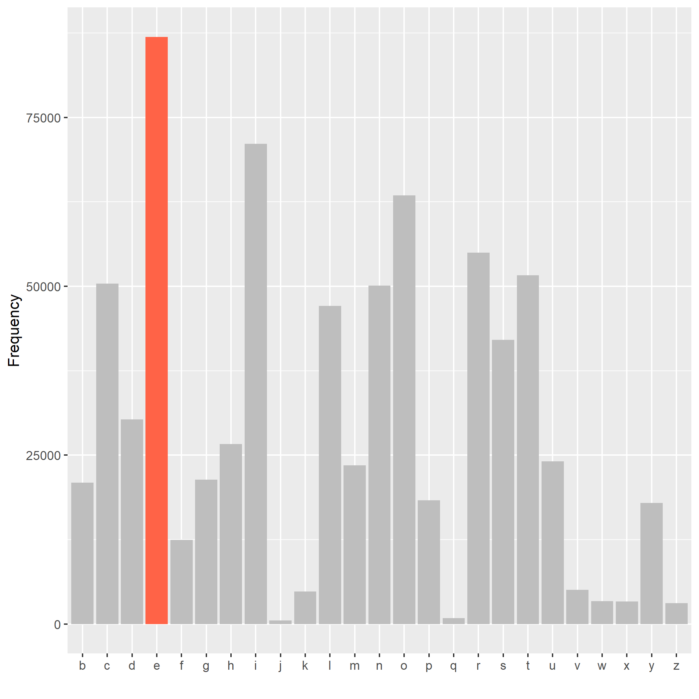
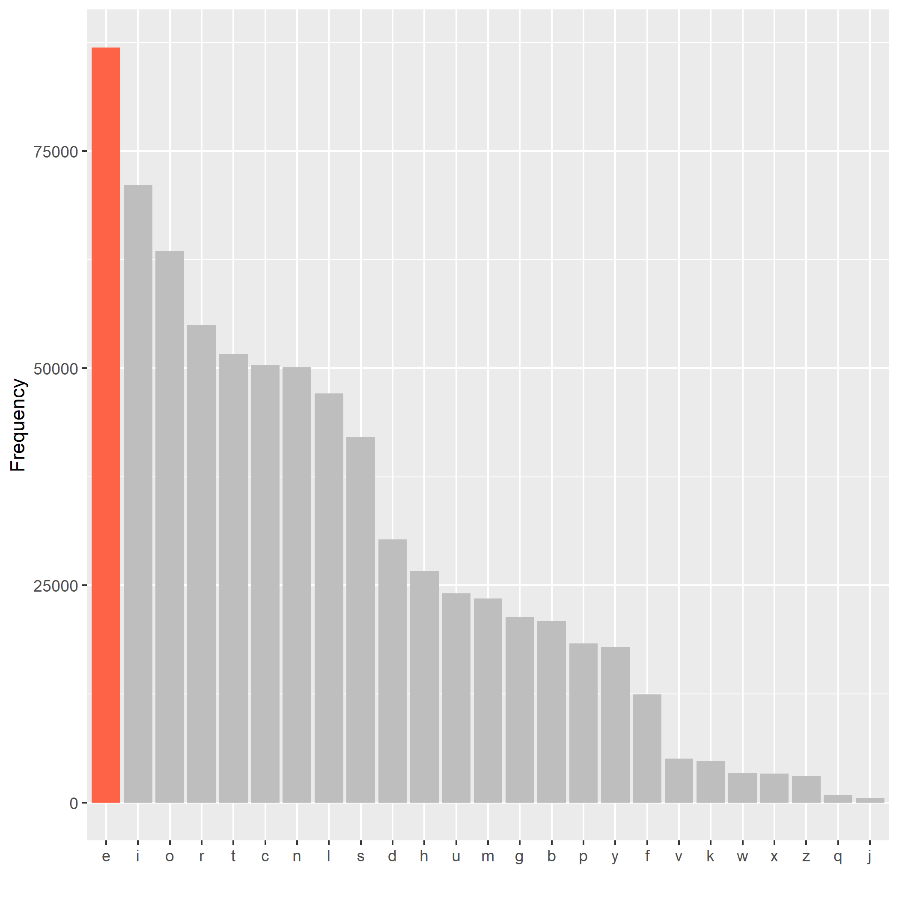

```{r load depencies, include = FALSE}
library(kableExtra)
letters_count <- read.delim("letters_count.tsv")
```

For this exercise, I downloaded a database of words in the english langauge from [FreeBSD](http://svnweb.freebsd.org/base/head/share/dict/web2?view=co").

I was curious which letters were more frequently used in the English language, so I computed the number of occurrences of each individual letter and tabulated the results below (Table 1).

```{r}
letters_count %>%
  kable("html") %>%
  kable_styling(bootstrap_options = c("striped", "hover", "condensed"), full_width = F) %>%
  column_spec(2, width = "15em") %>%
  row_spec(5, bold = T, background = "yellow")
```
**Table 1** Number of occurrences of each letter.


The most frequently used letter was **E**. 

Figure 1 below is a bar plot of the frequency of letters in the English language in alphabetical order.





Figure 2 sorts the above bar plot in descending order of frequency.




